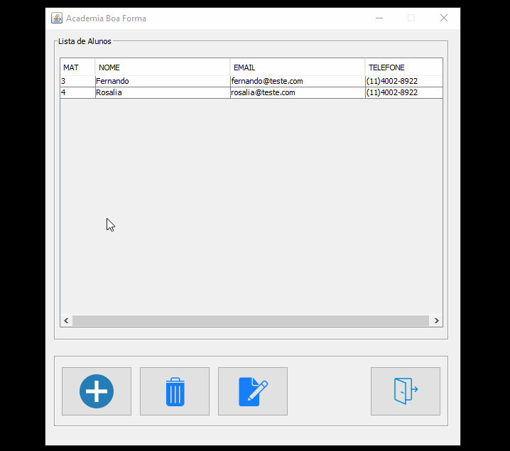
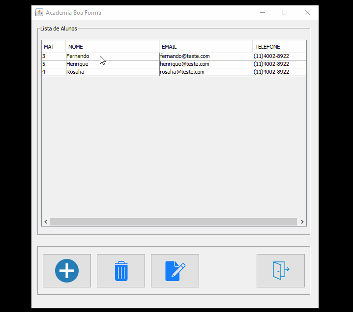

# Academia-Desktop-Java
A Java Desktop Application
---

## Proposal and Requirements
The main objective was to create a gym system, that should be possible to register the client, including it's biometric data, as height, weight and age, and calculate the IMC, TMB and FCM. 
The Project was built to practice the concepts of object oriented programming and Java SE methods, as the MVC pattern, learned in SENAI Prof. Vicente Amatto technical school.

In this way, the project should focus on creating a Java Desktop CRUD in its direct interaction with MySQL, and should:

- Store the client personal and biometric information;

- Enable the editing of the client's information;

- Calculate the IMC, FCM and TMB and update it if necessary;

- Remove client from the database;

- Display the registered clients on the main frame
---

## Database
**To store the magic**

MySQL was chosed to build the dabatase, that include the table tbl_clientes, that stores the client's information.

---

## Functionalities
**The potentials**

### Create

It's possible to register a new client with all the personal information and show the health situation about the weight according the parameters.

### Update

It's possible to update the client information, also the result of health situation.

### Delete

To remove the client from register, just push the delete button.

To perform, run as a Java Application on the AcademiaApp.java class.

*Everything made with a lot of curiosity and programming passion*
